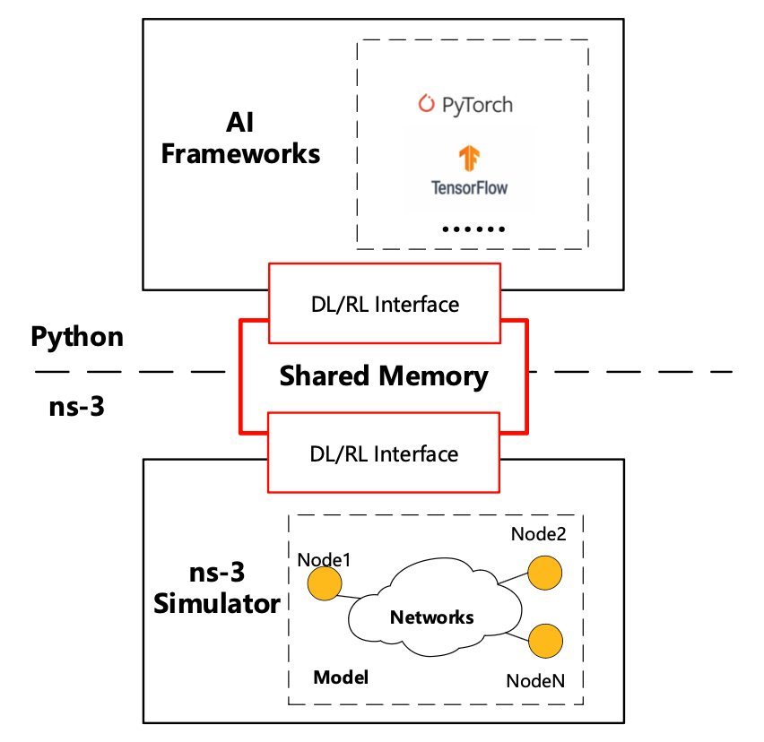

# ns3-ai

## Introduction

[ns–3](https://www.nsnam.org/) is widely recognized as an excellent open-source networking simulation
tool utilized in network research and education. In recent times, there has been a growing interest in
integrating AI algorithms into network research, with many researchers opting for open-source frameworks
such as [TensorFlow](https://www.tensorflow.org/) and [PyTorch](https://pytorch.org/). Integrating the
ML frameworks with simulation tools in source code level has proven to be a challenging task due to their
independent development. As a result, it is more practical and convenient to establish a connection
between the two through interprocess data transmission.

<p align="center">
    
</p>

Our model offers an efficient solution to facilitate the data exchange between ns-3 and Python-based
AI frameworks. It does not implement any specific AI algorithms. Instead, it focuses on enabling
interconnectivity between Python and C++. Therefore, it is necessary to separately install the desired AI
framework. Then, by cloning or downloading our work and importing the relevant Python modules, you can
seamlessly exchange data between ns-3 and your AI algorithms.

The approach for enabling this data exchange is inspired by [ns3-gym](https://github.com/tkn-tub/ns3-gym),
but it utilizes a shared-memory-based approach, which not only ensures faster execution but also provides
greater flexibility.

### Features

- High-performance data interaction module in both C++ and Python side.
- A high-level [Gym interface](model/gym-interface) for using Gymnasium APIs, and a low-level
  [message interface](model/msg-interface) for customizing the shared data.
- Useful skeleton code to easily integrate with AI frameworks on Python side.

## Installation

Check out [install.md](./docs/install.md) for how to install and setup ns3-ai.

## Quickstart on ns3-ai

### Demo

To get started on ns3-ai, check out the [A-Plus-B](examples/a-plus-b) example. This example shows how
C++ passes two numbers to Python and their sum is passed back to C++, with the implementation using
all available interfaces: Gym interface, message interface (struct-based) and message
interface (vector-based).

### Documentation

Ready to deploy ns3-ai in your own research? Before you code, please go over the tutorials on
[Gym interface](model/gym-interface) and [message interface](model/msg-interface). They provide
step-by-step guidance on writing C++-Python interfaces, with some useful code snippets.

We also created some **pure C++** examples, which uses C++-based ML frameworks to train
models. They don't rely on interprocess communication, so there is no overhead in serialization
and interprocess communication. See [using-pure-cpp](docs/using-pure-cpp.md) for details.

## Examples

Please refer to the README.md in corresponding directories for more information.

### [A-Plus-B](examples/a-plus-b)

This example show how you can use ns3-ai by a very simple case that you transfer `a` and `b` from ns-3 (C++) to Python
and calculate `a + b` in Python to put back the results.

### [Multi-BSS](examples/multi-bss)

This example simulates a VR gaming scenario. We change the CCA threshold using DQN
to meet VR delay and throughput requirements. Model optimization is in progress.

### [RL-TCP](examples/rl-tcp/)

This example is inspired by [ns3-gym example](https://github.com/tkn-tub/ns3-gym#rl-tcp). We build this example for the
[benchmarking](./docs/benchmarking) and to compare with their module.

### [Rate-Control](examples/rate-control)

This is an example that shows how to develop a new rate control algorithm for the ns-3 Wi-Fi module using ns3-ai.
Available examples are Constant Rate and Thompson Sampling.

### [LTE-CQI](examples/lte-cqi/)

This original work is done based on [5G NR](https://5g-lena.cttc.es/) branch in ns-3. We made some changes to make it
also run in LTE codebase in ns-3 mainline. We didn't reproduce all the experiments on LTE, and the results in our paper
are based on NR work.

## Other materials

### Google Summer of Code 2023

'ns3-ai improvements' has been chosen as one of the [project ideas](https://www.nsnam.org/wiki/GSOC2023Projects)
for the ns-3 projects in [GSoC 2023](https://summerofcode.withgoogle.com/programs/2023). The project
developed the message interface (struct-based & vector-based) and Gym interface, provided more examples
and enhanced stability and usability.

- Project wiki page: [GSOC2023ns3-ai](https://www.nsnam.org/wiki/GSOC2023ns3-ai)

### Online tutorial

Note: this tutorial explains the original design, which is not up to date with the newer interface.

Join us in this [online recording](https://vimeo.com/566296651) to get better knowledge about ns3-ai.
The slides introducing the ns3-ai model could also be found [here](https://www.nsnam.org/wp-content/uploads/2021/tutorials/ns3-ai-tutorial-June-2021.pdf).

## Cite Our Work

Please use the following bibtex:

```
@inproceedings{10.1145/3389400.3389404,
author = {Yin, Hao and Liu, Pengyu and Liu, Keshu and Cao, Liu and Zhang, Lytianyang and Gao, Yayu and Hei, Xiaojun},
title = {Ns3-Ai: Fostering Artificial Intelligence Algorithms for Networking Research},
year = {2020},
isbn = {9781450375375},
publisher = {Association for Computing Machinery},
address = {New York, NY, USA},
url = {https://doi.org/10.1145/3389400.3389404},
doi = {10.1145/3389400.3389404},
booktitle = {Proceedings of the 2020 Workshop on Ns-3},
pages = {57–64},
numpages = {8},
keywords = {AI, network simulation, ns-3},
location = {Gaithersburg, MD, USA},
series = {WNS3 2020}
}

```