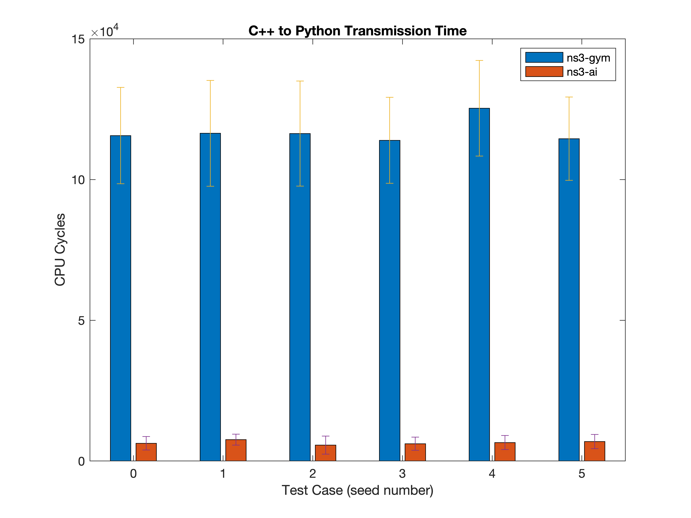
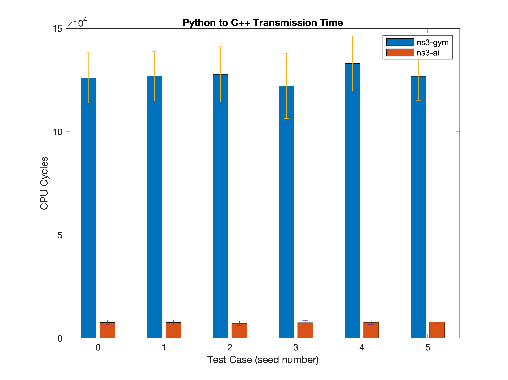
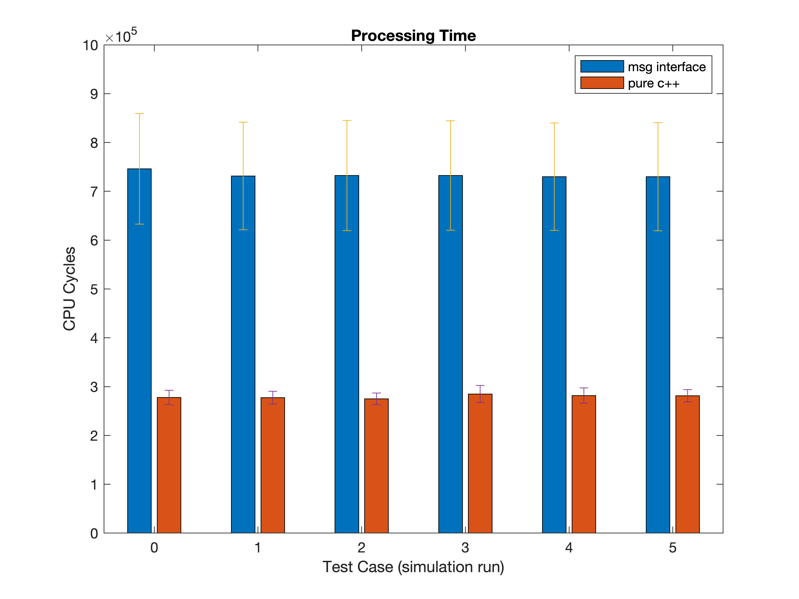

# ns3-ai Benchmarking

## 1. Gym interface vs. ns3-gym

This benchmark is based on the [RL-TCP](../../examples/rl-tcp) example,
in which we record the CPU cycle count during C++ to Python and Python to
C++ data transmissions, and compare the mean and standard deviation of cycles.

In this benchmark, we seed both programs with the same numpy and torch
seeds, and `SeedManager::SetRun` is set to default (0).

### Code

- Gym interface is based on [midterm_benchmarking](https://github.com/ShenMuyuan/ns3-ai/tree/midterm_benchmarking)
branch of ns3-ai.
- ns3-gym is based on a [forked branch](https://github.com/ShenMuyuan/ns3-gym)
of ns3-gym, in which we modified the algorithm to yield the same result
with ns3-ai.

The results are collected from console output and stored in [a .m file](./gym-interface-data.m)
to draw figures with Matlab.

### Results

Results show that in both directions, the transmission time of ns3-ai's Gym
interface is more than 15 times shorter than that of ns3-gym.

    

    

## 2. Vector-based vs. struct-based

The benchmark is based on [Multi-BSS](../../examples/multi-bss) example, on
[benchmark_vector](https://github.com/ShenMuyuan/ns3-ai/tree/benchmark_vector) branch.

Unfortunately, in terms of action transmission time (from C++'s beginning of
write to Python's complete read), the vector-based is 1.2 times slower
than the struct-based. The extra time is caused by Python's slow reading of vectors.
Measurements show that in reading `rxPower` (received power in nodes in first BSS)
at Python side, vector interface spent 20% to 50% more time than struct interface.

To deal with the slow vector access on Python side, one possible solution is to
integrate [Eigen](https://eigen.tuxfamily.org/index.php?title=Main_Page) on C++ side
and use existing Eigen-Python bindings like [pybind11's Eigen support](https://pybind11.readthedocs.io/en/stable/advanced/cast/eigen.html)
or [eigenpy](https://github.com/stack-of-tasks/eigenpy) to convert linear algebra
types into numpy or scipy types. This leads to another issue which is the decoupling
of current vector and struct interface. Vector interface is currently based on struct
interface for dealing with 'vector of struct'. If vector is becoming 'purely linear algebra',
this dependency no longer exists and the code needs substantial changes.

## 3. Pure C++ vs. C++-Python interface

The benchmark is based on the [pure C++ (libtorch)](../../examples/rl-tcp/pure-cpp) and
[message interface (PyTorch)](../../examples/rl-tcp/use-msg) version of RL-TCP example.
We compare the processing time (i.e. transmission time + DRL algorithm time
for message interface, DRL algorithm time for pure C++) for the two interfaces,
including the mean and the standard deviation. The difference can be considered
as the CPU cycles saved, due to:
1. The removal of interprocess communication, which saves thread waiting and
data serialization time.
2. The native C++ implementation of DRL algorithm with `libtorch`, which can
be potentially faster than PyTorch (a Python wrapper of the C++ core).

In this benchmark, we seed two programs with same `SeedManager::SetRun`.

**Note: the simulation results of message interface and pure C++ implementations
may be different, despite having same parameters. This is due to different
random seeding (the pure C++ example doesn't provide seeding equivalent to numpy's
seeding).**

### Code

Both sides of the benchmarking code can be found at [benchmark_purecpp branch](https://github.com/ShenMuyuan/ns3-ai/tree/benchmark_purecpp).

The results are collected from console output and stored in [a .m file](./pure-cpp-data.m)
to draw figures with Matlab.

### Results

Results show that the processing time of pure C++ implementation
is more than twice shorter than that of message interface implementation.

    

