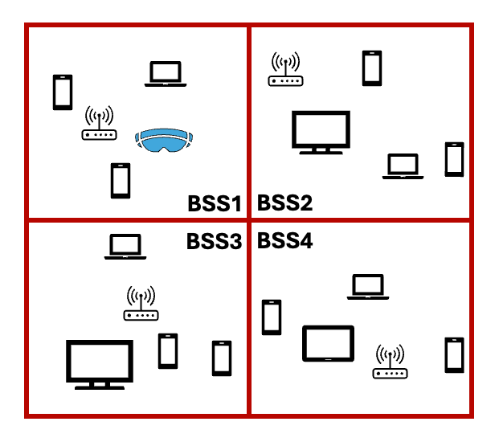
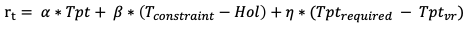

# Multi-BSS Example

## Introduction

The example is based on and modified from [juanvleonr's clean-tgax branch](https://gitlab.com/juanvleonr/ns-3-dev/-/tree/clean-tgax?ref_type=heads).
The C++ side simulates a VR gaming scenario showed below, in which 4 BSSs operate in
separate apartments in a 2 by 2 grid. Each BSS contains 1 AP and 4 STAs. One of the STA
in the first BSS is a VR device generating burst UL traffic, while other devices have normal
UL traffic.

<p align="center">
    
</p>

Python side dynamically adjusts clear channel assessment (CCA) threshold for BSS1. CCA
is a function in Wi-Fi that enables devices to listen to the PHY channel before sending
data. Signal from another device is considered valid if their SNR is higher than a minimum
level, called the CCA threshold.

An optimal CCA threshold is not achieved by having an extremely high or extremely
low CCA threshold. If the CCA threshold is set too high, the device may be unaware of
the presence of another sending device, leading to hidden terminal problem. On the other hand,
if the CCA threshold is set too low, the device may not attempt to transmit data even if
the channel is clear, reducing the efficiency of network.

In order to achieve the low delay and high bandwidth requirements for VR, DQN is used
to learn from past experiences and choose the best CCA threshold for BSS1.

The burst traffic generator is under [vr-app](./vr-app) directory. It is intended as a
module providing ns-3 applications including `BurstyApplication` and `BurstSink`. See
its documents for details.

### Scenario

#### 802.11ax TGax Residential Scenario
- Location of nodes: APs and STAs randomly distributed in 15m x 15m square of each apartment
- PHY channel: 4 BSSs co-channel (80 MHz)
- Tx power: 12 dBm for APs & STAs

#### VR constraints
- Delay
  - < 5ms@50%
  - < 10ms@95%
  - < 100ms@99.99%
- Bandwidth: ~50Mbps@4K

### DRL algorithm

#### State

- Reception power of each node in BSS1, can be represented as a (num of nodes in BSS1) x (total num of nodes) matrix.
- MCS of each node in BSS1
- UL throughput of each STAs
- Delay of the VR node

#### Action

- New CCA threshold for BSS1

#### Reward

<p align="center">
    
</p>

#### Policy net

2 fully connected layers with 64 neurons each layer.

### Simulation parameters

**Note: for reference only; many of these may change in the future.**

#### Traffic parameters for the VR node

- Traffic type: UL
- Traffic rate: Burst, 50 Mbps
- Burst size: 25000 Bytes (will be fragmented to multiple MPDUs)
- Burst interval: 5 ms
- MPDU size: 1500 Bytes

#### Traffic parameters for other nodes

- Traffic type: UL
- Traffic rate: CBR 0.3 Mbps
- MPDU size: 1500 Bytes
- Interval: 5000 ms

#### Other parameters

- MCS: For each STA, fix MCS based on the distance to the AP
- CCA threshold: change on BSS1, others are constant -82 dBm
- Simulation duration: 100 s

### Cmake targets

- `ns3ai_multibss`: Multi-BSS example using vector-based message interface.

## Running the example

1. [Setup ns3-ai](../../docs/install.md)
2. Build C++ executable & Python bindings

```shell
cd YOUR_NS3_DIRECTORY
./ns3 build ns3ai_multibss
```

3. Run Python script

```shell
pip install -r contrib/ai/examples/multi-bss/requirements.txt
cd contrib/ai/examples/multi-bss
python run_multi_bss.py
```

## Results

The VR delay, VR throughput, total throughput and CCA threshold values
are shown in the terminal every time step.

The optimization of the model is in progress. We are trying to make the
VR node meet the VR requirements by adjusting both simulation & algorithm
parameters.

